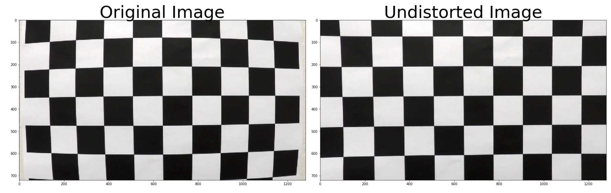
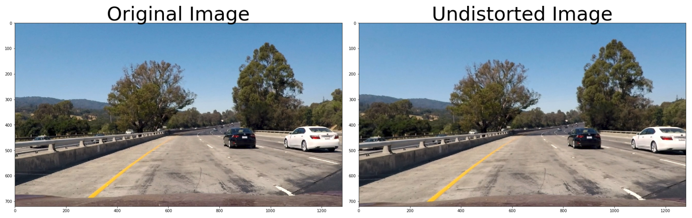
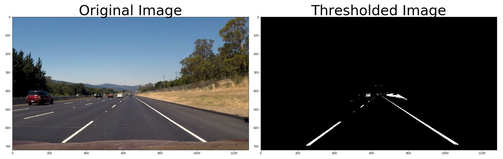
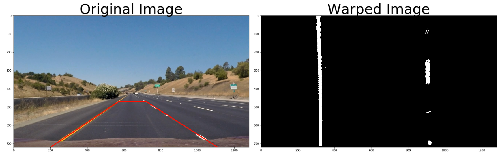
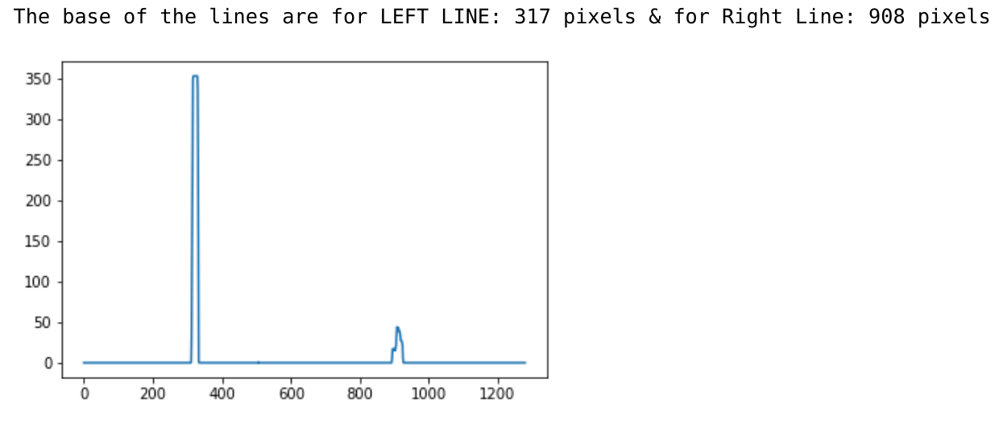
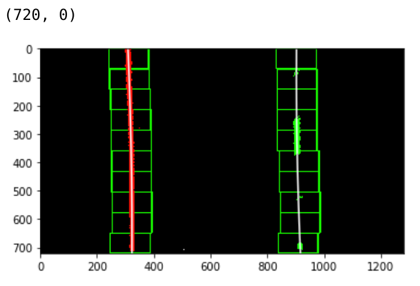
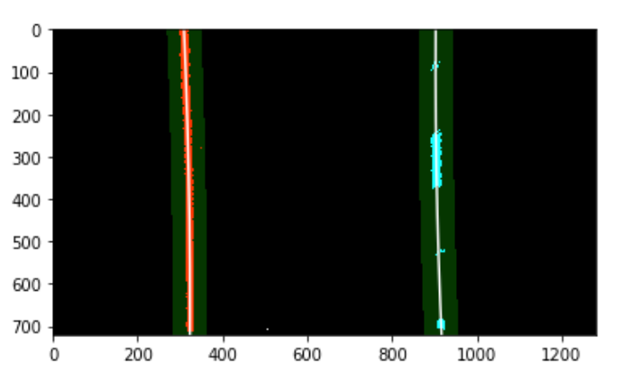
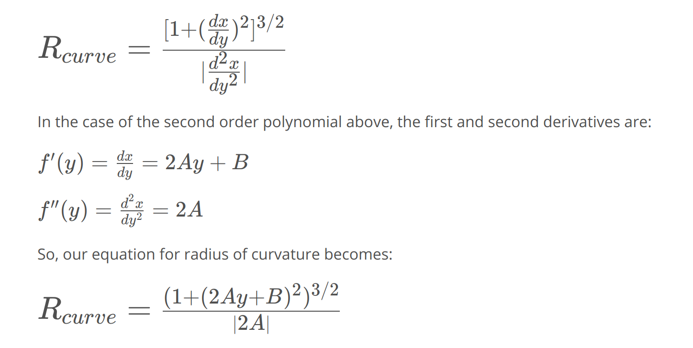
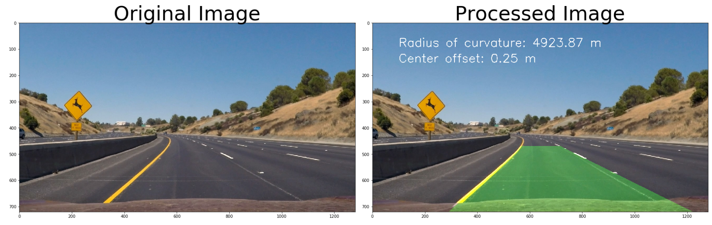

## Advanced Lane Finding using OpenCV
[](http://www.udacity.com/drive) 


The following project is a part of Udacity’s Self Driving car engineering NanoDegree program. The aim of project is to successfully find the radius of curvature as well as the vehicle offset from the lane.

The Project
---

The steps of this project are the following:

* Compute the camera calibration matrix and distortion coefficients given a set of chessboard images.
* Apply a distortion correction to raw images.
* Use color transforms, gradients, etc., to create a thresholded binary image.
* Apply a perspective transform to rectify binary image ("birds-eye view").
* Detect lane pixels and fit to find the lane boundary.
* Determine the curvature of the lane and vehicle position with respect to center.
* Warp the detected lane boundaries back onto the original image.
* Output visual display of the lane boundaries and numerical estimation of lane curvature and vehicle position. 

## The folder structure

| Name of Folder     | Contains                                      |
| ------------------ | --------------------------------------------- |
| Assets             | Resources for README                          |
| camera_cal         | Input images for camera calibration           |
| undistorted_images | Undistorted images after camera calibration   |
| test_images        | Test images for pipeline                      |
| test_images_output | Output images after image thresholding        |
| video_input        | Test videos for the final pipeline            |
| video_output       | Test video output (6 seconds each)            |
| video_output_final | Final output video folder (Full length video) |

## Prerequisites

- Pip 
- Python 3
- Virtual Environment

## Install instructions

`open terminal`

```bash
$ git clone https://github.com/Shivam-Bhardwaj/AdvanceLaneFinding.git
$ virtualenv --no-site-packages -p python3 venv 
$ source venv/bin/activate
$ cd AdvanceLaneFinding
$ pip install -r requirements.txt
$ jupyter notebook
```

`open FinalCode.ipnyb`

## [Rubric](https://review.udacity.com/#!/rubrics/571/view) Points

#### Here I will consider the rubric points individually and describe how I addressed each point in my implementation.  

------

### Writeup / README

#### 1. Provide a Writeup / README that includes all the rubric points and how you addressed each one.    

The given README.md file is an extensive writeup of the project. It includes the code folder architecture, resources, test output, Jupyter Notebook etc. For any questions, please contact 

Shivam Bhardwaj 

 [LinkedIn](<https://www.linkedin.com/in/shivamnyu/>) [Instagram](https://www.instagram.com/lazy.shivam/) [Facebook](<https://www.facebook.com/shivambhardwaj2008>) [Github](https://github.com/Shivam-Bhardwaj)

Mail to shivam.bhardwaj@nyu.edu

### Camera Calibration

#### 1. Briefly state how you computed the camera matrix and distortion coefficients. Provide an example of a distortion corrected calibration image.

The Camera calibration is taken care under the section of **Calibrating the camera**

I started by reading a random calibration image from `camera_cal` folder to get the parameters of the images.

Using the following code snippet:

```python
img = mpimg.imread('camera_cal/calibration11.jpg')
image_shape = img.shape

# nx and ny are taken as 9 & 6 respectively to denote the number of squares in the image.

nx = 9
ny = 6
```

I start by preparing `"object points"`, which will be the (x, y, z) coordinates of the chessboard corners in the world. Here I am assuming the chessboard is fixed on the (x, y) plane at z=0, such that the object points are the same for each calibration image.  

Thus, `objp` is just a replicated array of coordinates, and `objpoints` will be appended with a copy of it every time I successfully detect all chessboard corners in a test image.  `imgpoints` will be appended with the (x, y) pixel position of each of the corners in the image plane with each successful chessboard detection.  

I then used the output `objpoints` and `imgpoints` to compute the camera calibration and distortion coefficients using the `cv2.calibrateCamera()` function.  I applied this distortion correction to the test image using the `cv2.undistort()` function and obtained this result: 



### Pipeline (single images)

#### 1. Provide an example of a distortion-corrected image.

Using the distortion correction parameters obtained above I used the follwing line to get an undistorted image shown below:


#### 2. Describe how (and identify where in your code) you used color transforms, gradients or other methods to create a thresholded binary image.  Provide an example of a binary image result.

The section **Declaring functions important for Gradients and Color transforms** has the functions for performing different image transforms and masks. The code significantly self explanatory. However, they are explained briefly below:

- `get_thresholded_image(img)` Function to do the undistortion, conversion to grayscale and creating a mask based on pixel threshold

  - `cv2.undistort(img, cameraMatrix, distortionCoeffs, None, cameraMatrix)`
  - `cv2.cvtColor(img, cv2.COLOR_RGB2GRAY)`
  -  `mask = np.zeros_like(color_combined)`

- `abs_sobel_thresh(gray, orient='x', thresh_min=0, thresh_max=255)` 

  - ```python
     if orient == 'x':
            sobel = cv2.Sobel(gray, cv2.CV_64F, 1, 0)
        else:
            sobel = cv2.Sobel(gray, cv2.CV_64F, 0, 1)
    ```

- `dir_threshold(gray, sobel_kernel=3, thresh=(0, np.pi/2))`

The following image is an example when the above filters are applied.



#### 3. Describe how (and identify where in your code) you performed a perspective transform and provide an example of a transformed image.

To obtain the perspective transform OpenCV's `cv2.warpPerspective(thresholded, M, img_size , flags=cv2.INTER_LINEAR)` function is used. For which the source and destination points are chosen as explained below.

```python
# Vertices extracted manually for performing a perspective transform

bottom_left = [200,720]
bottom_right = [1110, 720]
top_left = [570, 470]
top_right = [722, 470]
```

```python
source = np.float32([bottom_left,bottom_right,top_right,top_left])
```

```python
# Destination points are chosen such that straight lanes appear more or less parallel in the transformed image.

bottom_left = [320,720]
bottom_right = [920, 720]
top_left = [320, 1]
top_right = [920, 1]
```

This resulted in the following source and destination points:

| Point        |  Source   | Destination |
| ------------ | :-------: | :---------: |
| bottom_left  |  200,720  |   320,720   |
| bottom_right | 1110, 720 |  920, 720   |
| top_left     | 570, 470  |   320, 1    |
| top_right    | 722, 470  |   920, 1    |

I verified that my perspective transform was working as expected by drawing the `src` and `dst` points onto a test image and its warped counterpart to verify that the lines appear parallel in the warped image.

![alt text][image4]

After performing color thresholding:



#### 4. Describe how (and identify where in your code) you identified lane-line pixels and fit their positions with a polynomial?

To get the final second degree polynomial for the lanes, I had to perform multiple steps.

To begin with, a histogram was created from the bottom half of the image to get the lane starting as shown below.

```python
histogram = np.sum(warped[warped.shape[0]//2:,:], axis=0)

# Peak in the first half indicates the likely position of the left lane

half_width = np.int(histogram.shape[0]/2)
leftx_base = np.argmax(histogram[:half_width])

# Peak in the second half indicates the likely position of the right lane

rightx_base = np.argmax(histogram[half_width:]) + half_width

plt.plot(histogram)
print("The base of the lines are for LEFT LINE:",leftx_base,"pixels & for Right Line:", rightx_base, "pixels")
```



Then the whole image was divided into 10 windows to perform a sliding window search.

```python
num_windows = 10
num_rows = warped.shape[0]
window_height = np.int(num_rows/num_windows)
window_half_width = 70
```

A sliding window search is done per window in vertical direction. If there is a significant change in the sum of pixels in vertical direction the bounding box`(represented in green)` is shifter per consecutive window. Till it is done on the whole image. 

**NOTE: This is only performed on first frame.**



Based on the center of the bounding boxes,  `np.polyfit(right_y, right_x, 2)` is executed to get the second order polynomial function for the **first frame** as shown below.

![alt text][image5]

For the consecutive frames the lane is searched only in  `+/- 40 pixels`, as shown below.



#### 5. Describe how (and identify where in your code) you calculated the radius of curvature of the lane and the position of the vehicle with respect to center.

The radius is computed using the following formula



The following code performs the calculation of radius.

```python
def measure_radius_of_curvature(x_values):
    ym_per_pix = 30/720 # meters per pixel in y dimension
    xm_per_pix = 3.7/700 # meters per pixel in x dimension
    # If no pixels were found return None
    y_points = np.linspace(0, num_rows-1, num_rows)
    y_eval = np.max(y_points)

    # Fit new polynomials to x,y in world space
    fit_cr = np.polyfit(y_points*ym_per_pix, x_values*xm_per_pix, 2)
    curverad = ((1 + (2*fit_cr[0]*y_eval*ym_per_pix + fit_cr[1])**2)**1.5) / 	np.absolute(2*fit_cr[0])
    return curverad
```

#### 6. Provide an example image of your result plotted back down onto the road such that the lane area is identified clearly.

Everything mentioned above is boxed in a function called `pipeline_final(img)` that takes in an image and  perform the lane detection, as shown below:



------

### Pipeline (video)

##### [Original project video](./video_output_final/project_video_output.mp4)

##### [Challenge video](./video_output_final/challenge_video_output.mp4)

##### [Harder Challenge video](./video_output_final/harder_challenge_video_output.mp4)

------

### Discussion

To begin with I would like to thank Udacity team for compiling everything in such an amazing tutorial. Following are my take on the overall project.

- When I begun this project. I had rough idea of what to do from the previous lane finding project, however this one is far more robust than that. However, since this is still just OpenCV based, it requires a lots of parameter tweaking to get a satisfactory result.

- The camera distortion looks like have no effect on the final video output. This might be because the videos are taken from a different camera than the camera used to take the chess board images.

- **NOTE** there is difference between importing the image from OpenCV and MatplotLib. This was evident while saving the images, I wasted a lot of time why my images were coming as if I was color blind :p

- The perspective transform is more or less hard-coded which made the code less robust.

- The parameters like window_half_width and finding the lane in next from in +/- 40 pixels are the main cause of failure of the code in the harder challenge video. This is due to the fact that the lane curvature is suddenly going over 45 degrees, which the system cannot adjust for. One way to get the results is to use the Convolution based approach as explained in one of the lectures. 

- However, this is also caused by the fact that I am averaging the output over 12 frames. Which makes the code less susceptible for sudden changes but, causes the system to fail in sharp turns as in harder challenge.

- One more cause of failure is that the lanes in the harder challenge almost bend to 90 degrees; the Sobel filter that I have applied works only for lanes that are more or less vertical. This is shown in the figure below: 
  **As you can see that the turn is almost horizontal, and the Sobel filter should fail in such case.**

  

The code was tested on the following specifications

- **CPU:** `Intel(R) Core(TM) i9-8950HK CPU @ 4.8 Ghz`
- **GPU:** `Nvidia GeForce GTX 1050 Ti Mobile`
- **OS:** `Ubuntu 16.04.6 LTS (Xenial Xerus)` 
- **Kernal:** `4.15.0-48-generic`

To get a frame rate of ~11 FPS (without distortion correction)

[//]: #	"Image References"
[image1]: ./camera_cal/calibration1.jpg	"Undistorted"
[image2]: ./test_images/test1.jpg	"Road Transformed"
[image3]: ./examples/binary_combo_example.jpg	"Binary Example"
[image4]: ./examples/warped_straight_lines.jpg	"Warp Example"
[image5]: ./examples/color_fit_lines.jpg	"Fit Visual"
[image6]: ./examples/example_output.jpg	"Output"
[video1]: ./project_video.mp4	"Video"


